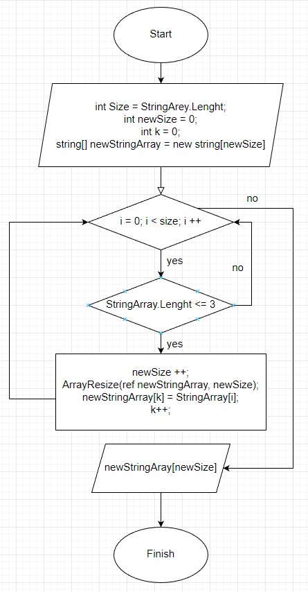

# Контрольная работа по первому блоку обучения программы "Разработчик"

### Задача:

> Написать программу, которая из имеющегося массива строк формирует массив из строк, длина которых меньше либо равна 3 символа. Первоначальный массив можно ввести с клавиатуры, либо задать на старте выполнения алгоритма. При решении не рекомендуется пользоваться коллекциями, лучше обойтись исключительно массивами.

## Содержание контрольной работы:

1. Блок-схема алгоритма решения задачи
2. Программа выполняющая разработанный алгиритм
3. Файл README с описанием выполненной задачи

В блок-схеме описана реализация основного метода по отбору элементов массива, не превышающих трех символов, и формирования из них нового массива.

## В программе реализованы следующие методы:

1. Ввод певичного массива с клавиатуры
2. Метод отбора элементов длинна строк которых равна или меньше 3 символов
3. Вывод первичного массива и массива из отобранных элементов
